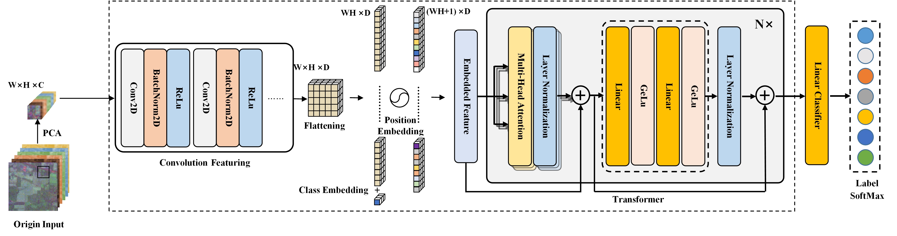

# Enhancing Hyperspectral Image Classification:Leveraging Unsupervised Information With Guided Group Contrastive Learning

[Ben Li](), [Leyuan Fang](), [Ning Chen](), [Jitong Kang](), [Jun Yue]()
___________

The code in this toolbox implements the ["Enhancing Hyperspectral Image Classification:Leveraging Unsupervised Information With Guided Group Contrastive Learning"](https://ieeexplore.ieee.org/document/10382626). 

**The codes for this research include the GGCL network model: ./src/models/cross_transformer.py.**

More specifically, it is detailed as follow.



Citation
---------------------

**Please kindly cite the papers if this code is useful and helpful for your research.**

```
B. Li, L. Fang, N. Chen, J. Kang and J. Yue, "Enhancing Hyperspectral Image Classification: Leveraging Unsupervised Information With Guided Group Contrastive Learning," in IEEE Transactions on Geoscience and Remote Sensing, doi: 10.1109/TGRS.2024.3350700.
```

```
@ARTICLE{10382626,
  author={Li, Ben and Fang, Leyuan and Chen, Ning and Kang, Jitong and Yue, Jun},
  journal={IEEE Transactions on Geoscience and Remote Sensing}, 
  title={Enhancing Hyperspectral Image Classification: Leveraging Unsupervised Information With Guided Group Contrastive Learning}, 
  year={2024},
  volume={},
  number={},
  pages={1-1},
  doi={10.1109/TGRS.2024.3350700}}
```

<!--The source files are being checked and summarized, and then will be published soon.
-->


Licensing
---------

Copyright (C) 2023 Ning Chen

This program is free software: you can redistribute it and/or modify it under the terms of the GNU General Public License as published by the Free Software Foundation, version 3 of the License.

This program is distributed in the hope that it will be useful, but WITHOUT ANY WARRANTY; without even the implied warranty of MERCHANTABILITY or FITNESS FOR A PARTICULAR PURPOSE. See the GNU General Public License for more details.

You should have received a copy of the GNU General Public License along with this program.